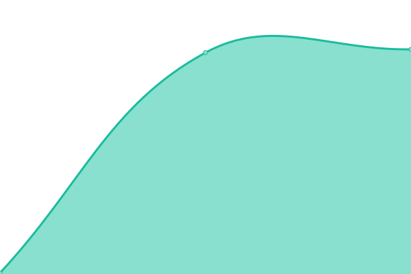

# [📈 Live Status][live-status]: <!--live status--> **🟩 All systems operational**

This repository contains the open-source uptime monitor and status page for [Brad Knox][website], powered by [Upptime][upptime-repo].

[![Uptime CI][uptime-ci-badge]][uptime-ci-link]
[![Response Time CI][response-time-ci-badge]][response-time-ci-link]
[![Graphs CI][graphs-ci-badge]][graphs-ci-link]
[![Static Site CI][static-site-ci-badge]][static-site-ci-link]
[![Summary CI][summary-ci-badge]][summary-ci-link]

With [Upptime][upptime-docs], you can get your own unlimited and free uptime monitor and status page, powered entirely by a GitHub repository. We use [Issues][issues] as incident reports, [Actions][actions] as uptime monitors, and [Pages][status-page] for the status page.

<!--start: status pages-->
<!-- This summary is generated by Upptime (https://github.com/upptime/upptime) -->
<!-- Do not edit this manually, your changes will be overwritten -->
<!-- prettier-ignore -->
| URL | Status | History | Response Time | Uptime |
| --- | ------ | ------- | ------------- | ------ |
|  [Knox Racquet Stringing](https://knoxstringing.com) | 🟩 Up | [knox-racquet-stringing.yml](https://github.com/bknox83/knoxstringing-status/commits/HEAD/history/knox-racquet-stringing.yml) | 

 204ms
     
 | 

<a href="https://status.knoxstringing.com/history/knox-racquet-stringing">100.00%</a>
    

<!--end: status pages-->

[**Visit our status website →**][status-page]

## 📄 License

- Powered by: [Upptime][upptime-repo]
- Code: [MIT][license] © [Anand Chowdhary][anand], supported by [Pabio][pabio]
- Data in the `./history` directory: [Open Database License][odbl]

[live-status]: https://status.knoxstringing.com
[website]: https://knoxstringing.com
[upptime-repo]: https://github.com/upptime/upptime
[upptime-docs]: https://upptime.js.org
[issues]: https://github.com/bknox83/knoxstringing-status/issues
[actions]: https://github.com/bknox83/knoxstringing-status/actions
[status-page]: https://status.knoxstringing.com
[license]: ./LICENSE
[anand]: https://anandchowdhary.com
[pabio]: https://pabio.com
[odbl]: https://opendatacommons.org/licenses/odbl/1-0/
[uptime-ci-link]: https://github.com/bknox83/knoxstringing-status/actions?query=workflow%3A%22Uptime+CI%22
[response-time-ci-link]: https://github.com/bknox83/knoxstringing-status/actions?query=workflow%3A%22Response+Time+CI%22
[graphs-ci-link]: https://github.com/bknox83/knoxstringing-status/actions?query=workflow%3A%22Graphs+CI%22
[static-site-ci-link]: https://github.com/bknox83/knoxstringing-status/actions?query=workflow%3A%22Static+Site+CI%22
[summary-ci-link]: https://github.com/bknox83/knoxstringing-status/actions?query=workflow%3A%22Summary+CI%22
[uptime-ci-badge]: https://github.com/bknox83/knoxstringing-status/workflows/Uptime%20CI/badge.svg
[response-time-ci-badge]: https://github.com/bknox83/knoxstringing-status/workflows/Response%20Time%20CI/badge.svg
[graphs-ci-badge]: https://github.com/bknox83/knoxstringing-status/workflows/Graphs%20CI/badge.svg
[static-site-ci-badge]: https://github.com/bknox83/knoxstringing-status/workflows/Static%20Site%20CI/badge.svg
[summary-ci-badge]: https://github.com/bknox83/knoxstringing-status/workflows/Summary%20CI/badge.svg
